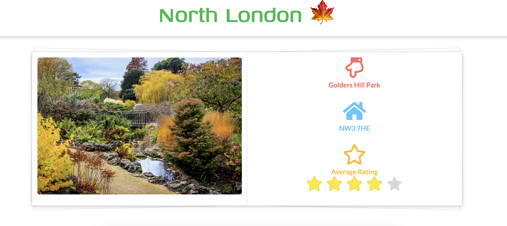
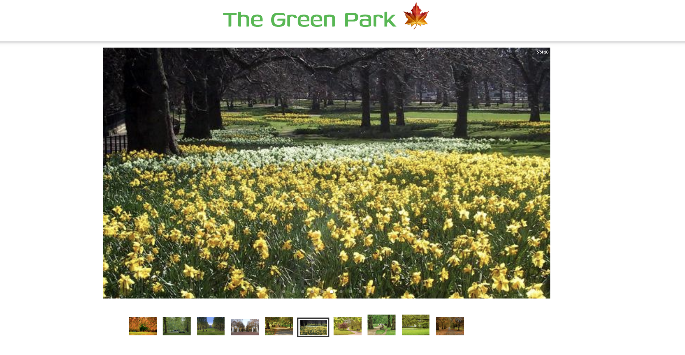
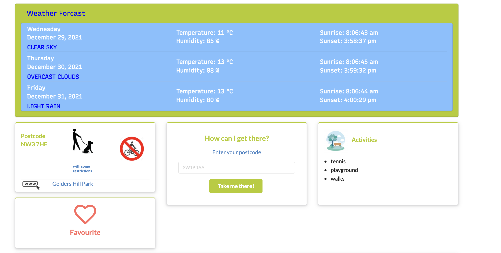
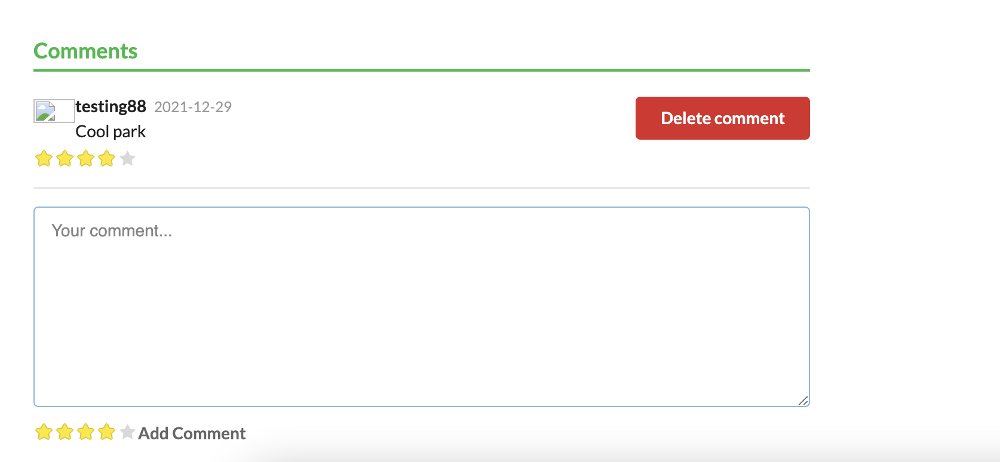
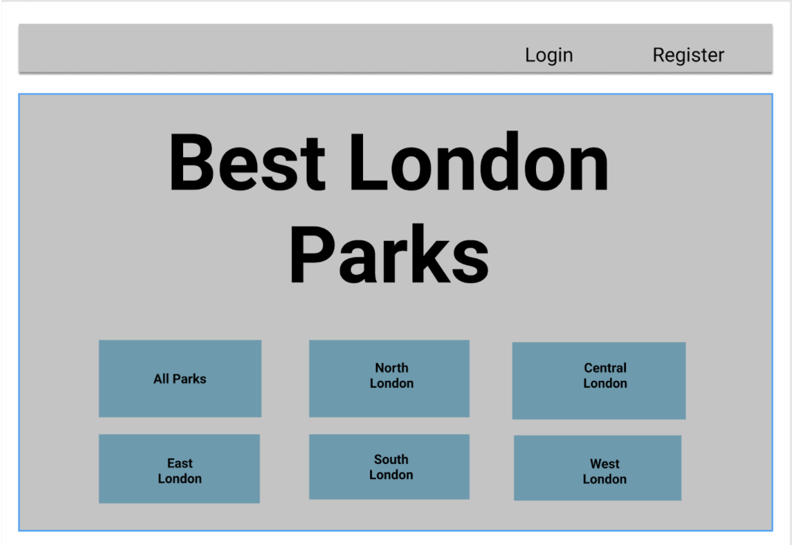
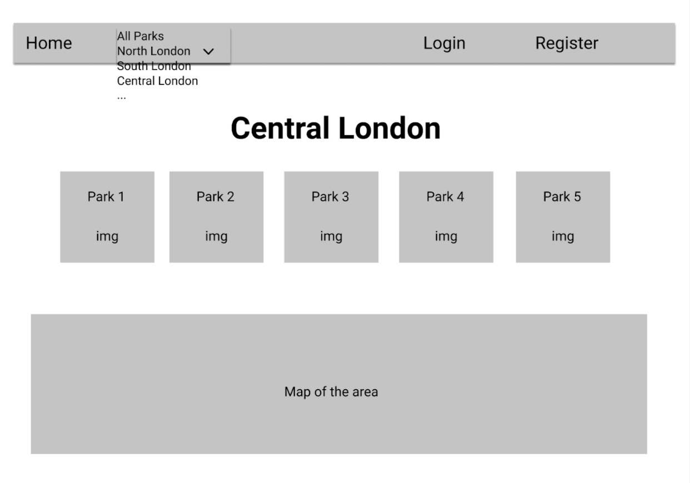
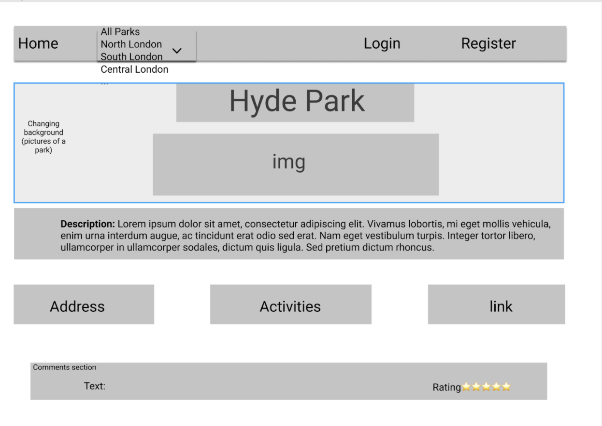

# London Parks - A Full Stack MERN Web App 

### Deployed on Heroku [here](https://london-parks.herokuapp.com/)

## Project Team 

* [Matthew Baxendale](https://github.com/mbaxendale22)
* [Piotr Jankowski](https://github.com/janek2204)
* [Mariana Lozynska](https://github.com/mlozynska)


## Overview
London parks was a group project developed in fulfilment of General Assembly's Software Engineering Immersive Bootcamp. It was the third project in the course and was the first full stack application any of the project team had delivered. The London Parks App allows users to search for parks in London, get key information about each park, and leave comments and reviews about parks they have visited.  While this Readme will offer an overview of the project as a whole, I will primarily be focused on outlining my specific contribution to the project by centering on features I was assigned.  

## Guest Credentials
You can make your own account using dummy credentials or use the following to log in: 

email: piotr@mail.com
password: Password123


## Technical Project Brief 


* Build a full-stack MERN application by making your own back-end and your own front-end
* Use an Express API to serve your data from a Mongo database
* Consume your API with a separate front-end built with React
* Be a complete product which most likely means multiple relationships and CRUD functionality for at least a couple of models
* Implement thoughtful user stories/wireframes that are significant enough to help you know which features are core MVP and which you can cut
* Be deployed online so it's publicly accessible
* Timeframe: 9 days


## User Stories

The user stories around which they project was planned and built are as follows: 

* Users can search for parks by geographical region (within London), or simply view all the parks in the collection. 
* Users receive a range of information about each park including: suggested activities, facilities available, the local weather forecast for the next few days.
* Users can get real-time travel information regarding the park
* Users can create an account, log in and sign out of the app.
* Users can add and remove a park to/from their list of favourite parks.
* Users can add comments and rate parks. 


## Tech Stack 

* MongoDB 
* Express
* React.js
* Node.js
* Mongoose
* BCrypt
* Axios
* React Semantic UI 
* React Mapbox GL
* Cloudinary
* AccuWeather API
* Framer Motion 
* React Toastify


## App Snapshot 
On the landing page users can chose a region by which to filter parks, see all the parks, or login/register to access the social features of the app


If a region is chosen, the region page is shown with cards containing key info about each park in that region, including an average rating for the park



the main park show page contains a picture carousel as well as information about the park





comments & a rating can be left for each park by registered users; users can delete their own comments & ratings




## Planning

JamBoard was used to design basic wireframes of the main pages:

Landing Page 



Region page



Park show page




## Development process 

The team worked collaboratively on initial planning and building out a RESTful API, with full CRUD functionality. Similarly, the basic layout of each page on the client side was worked on as a team. After the core functionality for the project was in place, features were assigned to team members to take the lead on. These features were built out fully on both the server and client sides of the application. When problems arose the team would either pair code to find solutions or meet altogether to discuss. The features for which I was lead are as follows: 

* User's can add a park to their 'favourites'
* User's can add comments and ratings to each park; they can delete their own ratings and comments
* User ratings are accumulated and an average rating is displayed for each park on the 'Region Page'
* User's can provide their postcode and be given real time travel information on how to get to a park


## Featured Code Snippet


The following code snippet is taken from the Favourites component, this component handles allowing a user to favourite a park and updating the UI accordingly.


First, we check if the user has already added this park to their favourites previously: 
```javascript
  //get the userData of the current user, will be used to check if this park is in their 
  // favourite parks key in the useEffect directly below
  useEffect(() => {
    const getData = async () => {
      const { data } = await axios.get('/api/profile', 
      {
        headers: { Authorization: `Bearer ${getTokenFromLocalStorage()}` }
      }
      )
      setUserData(data)
    }
    getData()
  }, [])
  
  // check if this park is already in the users FavouriteParks key, check to see if the 
  // userData request has returned before running main function.
  useEffect(()=> {
    const checkFavourite = () => {
      if (userData === null ) {
        return console.log('use effect running on initial render')
      }
      else {
        const checkPark = userData.favouriteParks.filter(x => x._id === park._id)
        checkPark.length ? setFavourite(true): console.log('not a fav park')
      }  
    }
    checkFavourite()
  }, [userData, park._id])

  ```

If the park is already in the user's favourites then the following UI is displayed (a filled heart icon) and a `removeFav` function provided to remove the park if the user wishes: 


```javascript

        <Segment raised class='parkPageColumns' color='olive'>
            <Header as='h3'icon textAlign='center' inverted color='red' >
              <Popup trigger ={<Icon onClick={removeFav} name = 'heart'/>}>
                <Popup.Content>
                  <p>Click to <strong>REMOVE</strong> this park from your favourites</p>
                </Popup.Content>
              </Popup>     
            <Header.Content>Favourite</Header.Content>
            </Header>
            </Segment>
```
The `removeFav` function sends a DELETE HTTP request to remove the park from that user's favourite park collection:

```javascript

const removeFav = async () => {
  setFavourite(false)
  try {
    await axios.delete('/api/favourite-parks', 
      {
        data: { targetPark: id },
        headers: { Authorization: `Bearer ${getTokenFromLocalStorage()}` }
      }
      )
  } catch (err) {
  console.log(err)
}

```

If the park is not in the users favourites already then things get more interesting. The main problem I faced here was making sure that the piece of state used to store the updated value of the user's favourite parks was updated before a POST or DELETE request was sent to the server. This sounds straightforward enough but as far as I'm aware its difficult to know when a piece of state within a function will actually be updated, i.e., when the setPieceOfState() function will be exectuted regardless of where it is called within the function. Accordingly, I attempted to seperate updating the value of the data from sending a HTTP request, by executing them from within different functions, with those functions being triggered by seperate UI mechanisms.

My solution was to use a `onMouseEnter()` and `onMouseExit()` as the mechanism to:

1. Toggle between displaying a full heart icon and a heart outline (UI update) and,
2. Set `favData` piece of state to the current park's ID, this piece of state will later be used as the data sent with the HTTP request:


```javascript

  //event handlers to toggle between an outline and full heart favourite icon
// also set state to be sent when the click event (handleclick) is triggered 


const handleMouseEnter = () => {
  const newFavData = { ...favData, targetPark: id }
  setFavData(newFavData)
  setToggle(true)
}
const handleMouseExit = () => {
  clicked ? setToggle(true) : setToggle(false)
}

```

The HTTP request to update the user's data on the server is trigged by the user clicking on the icon itself: 
                  
```javascript
    //make the request to add or remove this park from the user's favourite parks key in the db
    const handleClick = async () => {
      try {
        setToggle(true)
        setClicked(!clicked)
        if (!clicked) {
          await axios.post('/api/favourite-parks', favData, 
          {
            headers: { Authorization: `Bearer ${getTokenFromLocalStorage()}` }
          }
          )
        } else {
          await axios.delete('/api/favourite-parks', 
          {
            data: { favData },
            headers: { Authorization: `Bearer ${getTokenFromLocalStorage()}` }
          }
          )
        }
    } catch {
    console.log('error')
    } 

```

In order to stagger this process, I used a popup to prompt the user to click on the icon if they want to add the park to their favourites. Indicating to the user that although the heart was now filled (for example), they still needed to click on the icon to confirm.

The pop up needed to ask the correct question, i.e., whether the user should be ADDING or REMOVING the park from their favourites. The truth-value of `clicked` is used to control which of these messages is displayed to the user. The JSX used to render the correct options is as follows:  

```javascript

<Segment raised class='parkPageColumns' color='olive'>
            <Header as='h3'icon textAlign='center' inverted color='red' >
              <Popup 
                trigger ={
                  !toggle ? 
                  <Icon onMouseEnter ={handleMouseEnter} onClick={handleClick}  name ='heart outline'/> 
                  : <Icon onClick={handleClick} onMouseLeave={handleMouseExit} name ='heart'/>
                }>
                <Popup.Content>
                  {
                    clicked ? 
                    <p>Click to <strong>REMOVE</strong> this park from your favourites</p> 
                    : <p>Click to <strong>ADD</strong> this to your favourites</p>
                  }
                  </Popup.Content>
                </Popup>
                  <Header.Content>Favourite</Header.Content>
                </Header>
            </Segment>

  ```


The result is an experience similar to other 'liking' processes users might be used to (like Twitter, for example). The UI changes are fluid and the process is reliable and stable. Of course it would be better to have everything take place with a simple click rather than having to use a popup to prompt the user (again, like you find on Twitter). However, as first attempt I was pretty happy with the results. 


## Known Bugs

* Mapbox is not currently working post-deployment
* The notification confirming sign out sometimes displays 'see you soon undefined' rather than the user's username.

## Development Challenges & Wins
 
The aspect of this project I enjoyed this most was working collaboratively on a longer-form project within a team. We met twice a day, in the morning for a stand up, and in late afternoon to review the day's work and plan for tomorrow. Discussing and working through problems collaboratively - either through pair coding or as a group - was a thoroughly enjoyable part experience.

Development challenges specific to my role in the team included:

* To add a park to a user's 'favourites' was a challenge (as outlined in detailed above). I faced a similar challenge when allowing the user to rate the park by interacting with stars rather than just inputing a number. This was made easier by adopting a component from React Semantic UI set up to watch for changes to the stars -  a bit like a handleChange function might watch an input element.

* Initially I had planned to use Transport for London's Unified API to get real time travel data. However, with the project nearing a close I did not have enough time to explore the API fully. Instead I had the user's input build a query string that sent them directly to Transport for London's journey planner with the correct parameters already filled in. Although it would be ideal to have the information returned in the application itself, this was a solution that was stable and could be implemented in the time I had left.   


## Future Development

A priority for development is to fix remaining bugs. Future goals discussed by the group center on the social aspects of the app and include: 

* Nested comments (commenting on comments)     
* A fully featured user profile page and the ability to view other user's profile page      
* User's can submit information about current parks (perhaps seasonal changes to opening times or currently unavailable amenities or areas, for example) or even a new park, subject to admin approval.      


